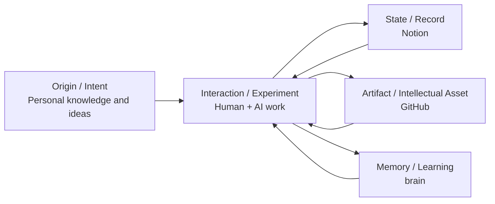

# ADP Knowledge Asset Model: State / Artifact / Memory

**Status:** Accepted  
**Date:** 2026-08-16  
**Context:** Organization Digital Twin / intellectual-asset management

## Decision

ADP separates its knowledge into three authoritative layers:

1. **State — Notion**  
   Live operational state and work records: Product, Epic, Story, Task, Sprint, status, timestamps, results, blockers and formal Decisions.
2. **Artifact — GitHub**  
   Durable intellectual assets deliberately created from work: operating models, policies, standards, architecture, capability maps, diagrams, templates and specifications.
3. **Memory — `cloud42-labo/brain`**  
   Accumulated organizational memory: learning, historical rationale, context and lessons that may later be synthesized into governed artifacts.

## Key insight: from personal knowledge to organizational intellectual assets

The useful unit is not simply **who owns a piece of knowledge**. In an AI-native organization, an idea may originate from one person but is then refined through human–AI dialogue, experiments, decisions, code, controls and feedback.

The more useful lifecycle is:

Personal knowledge remains important as the **origin and intent**, but value compounds when it becomes a reusable, versioned and governed organizational asset.

## Why this matters

- It prevents conversational memory from being mistaken for an authoritative artifact.
- It prevents GitHub from becoming a task-management database.
- It prevents Notion from becoming an uncontrolled copy of durable documents.
- It gives both humans and AI agents a predictable place to read and write each information class.
- It makes the Organization Digital Twin observable: current state, durable design and accumulated memory can be inspected separately and recombined.

## Consequence

ADP documentation and controls should be designed around the **knowledge lifecycle** — origin → interaction → state/artifact/memory → reuse — rather than only around individual ownership of intellectual property.
