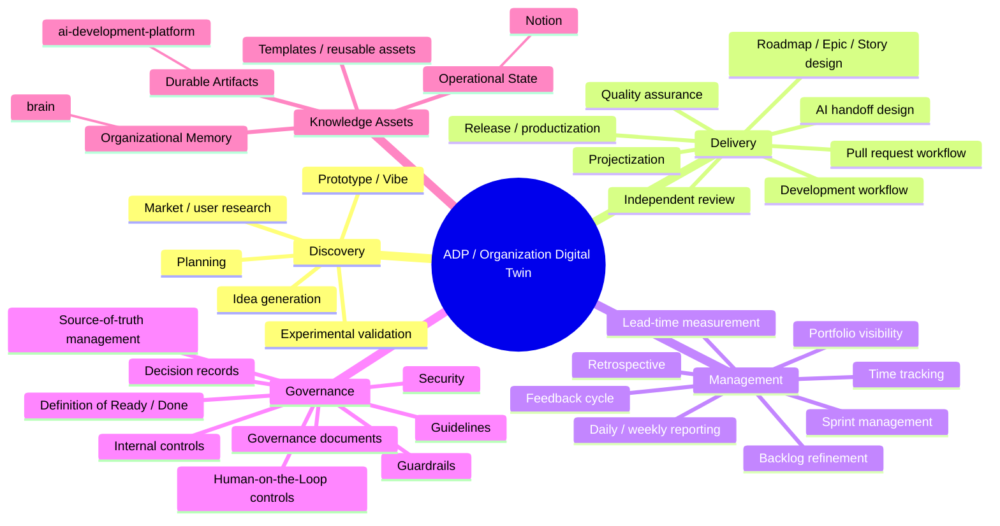

# ADP Organization Digital Twin — Capability Map

This is a living inventory of the capabilities implemented or governed by ADP. It is intentionally separate from the Development Lifecycle: the lifecycle shows **flow**, while this map shows **coverage**.

## How to use this map

- Add capabilities when ADP begins to manage or govern a new organizational function.
- Link each capability to its governing artifact, Notion process, or implementation evidence as the repository matures.
- Use gaps in the map as candidates for future Epics, but do not assume every visible gap requires implementation.
- Revisit the map during governance and architecture refinement.
