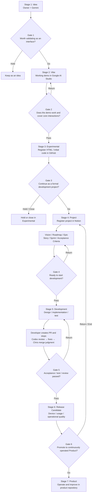

# Vibe Product Development — Operating Guide

> **Artifact status:** GitHub original for durable operating-model content. Notion remains the operational system of record for live Product/Epic/Story/Task/Sprint state, timestamps, results and Decisions.
>
> Migrated from the Notion Operating Guide on 2026-08-16 (JST).

## 1. Basic principles

- Notion is the system of record for planning, decisions, progress, daily reports, Sprint Reviews and Human Requests.
- GitHub is the system of record for code, specifications, pull requests, change history and durable ADP artifacts.
- Slack is not used for ADP operations.
- Work is managed as **Epic → Story → Task**.
- Immediately before starting a Task, record `Status = In Progress` and `Started At` in JST.
- At completion, record `Result`, `Completed At` in JST and `Status = Done`.
- Before implementation that depends on an external SDK, library or service, verify the latest primary documentation.
- Do not create a Human Request for information or actions an AI agent can directly verify through Notion, GitHub or another connected source.
- Do not fill unknowns by assumption. Record the exact blocker and next action.

## 2. AI roles

- **Claude** — primary development line; requirements understanding, design, implementation, fixes and role-separated workflows.
- **Claude Opus** — lead/manager for complex design decisions and final integration; delegates to Sonnet/Haiku where appropriate.
- **Claude Sonnet** — ordinary implementation, technical design and UI/UX design.
- **Claude Haiku** — research, mechanical verification and light work.
- **ChatGPT / Chris** — PM aide, Notion organization, cross-product review, failover, PR supervision and merge judgment.
- **Codex** — independent GitHub pull-request reviewer.
- **Gemini** — the Owner's planning/research second opinion; normally connected only to the Owner.

## 3. Development lifecycle

A **Stage** is a working state. A **Gate** is a decision condition for moving to the next Stage.

## 4. Stage and Gate definitions

1. **Stage 1: Idea** — clarify the problem, target user and value hypothesis with Gemini.  
   **Gate 1: Vibe decision** — is it worth creating an interface/experience to validate?
2. **Stage 2: Vibe** — use Google AI Studio to explore UI and interaction flow and create a working demo.  
   **Gate 2: Experimental decision** — does the demo work, cover core interactions and deserve preservation as initial code?
3. **Stage 3: Experimental** — manage prototype code in the Experimental GitHub area and perform additional validation.  
   **Gate 3: Project decision** — is it worth continuing as a formal development project? Deeper market/revenue validation normally follows creation of something users can touch.
4. **Stage 4: Project** — establish Vision, Roadmap, Epic, Story, Sprint and Acceptance Criteria.  
   **Gate 4: Development decision** — are the conditions needed to begin development complete?
5. **Stage 5: Development** — design, implement, test and perform quality checks; Codex independently reviews PRs where applicable.  
   **Gate 5: Release Candidate decision** — have acceptance criteria, tests and reviews passed without unresolved critical issues?
6. **Stage 6: Release Candidate** — validate real-device behavior, user experience, operations, security and continuity.  
   **Gate 6: Product decision** — does the product have sufficient value and quality for ongoing operation and improvement?
7. **Stage 7: Product** — provide, operate, measure and continuously improve the product in its formal repository using weekly Sprints.

## 5. Systems of record

| Information | System of Record | Notion handling |
|---|---|---|
| Product / Epic / Story / Task / Sprint | Notion | Holds formal operational state |
| Decisions / policy choices | Notion Decisions | Records conclusion and rationale |
| Product code | Product GitHub repository | Link from Notion; do not duplicate |
| Product specifications | Product GitHub repository | Notion holds reference and decision context |
| PR / review history | GitHub | Notion holds conclusion / next action only |
| Daily report / Sprint Review / Retrospective | Notion | Formal operational record |
| ADP durable operating artifacts | `cloud42-labo/ai-development-platform` | Notion holds reference and operating state |
| Organizational memory / accumulated learning | `cloud42-labo/brain` | Promote to artifact only when intentionally synthesized |

For the ADP knowledge model, see [`../governance/source-of-truth.md`](../governance/source-of-truth.md).

## 6. AI operating rules

### Common rules

- Before work, confirm Product, current Sprint, target Epic, Story, acceptance criteria and related GitHub links.
- Do not expand scope by assumption. Record unresolved matters in Decisions or Blocker.
- Do not duplicate source code or authoritative artifact text into Notion unless an operational view is intentionally maintained there.
- At the end of each execution phase, record current phase, completed work, PR/commit reference, unresolved items, stopping reason and next action in Notion.
- The Notion ticket is the execution instruction. External prompts should remain short and should not become a second detailed instruction source.

### PR / review / merge

- The implementation agent normally stops after completing required implementation/fixes and creating the PR.
- Codex independently reviews the PR diff, acceptance criteria and test evidence when required.
- Review findings live in GitHub; Notion records only the conclusion and next action.
- Do not merge with unresolved P0/P1 issues, failed CI, or required device verification incomplete.
- The merge role is normally separated from implementation and handled by ChatGPT / Chris for final verification.
- If an exception allows Claude to merge, all of the following must be true: the Owner has explicitly changed the merge responsibility; Codex review is complete where required; critical findings are resolved; CI is green; mergeability is clean; required real-device validation is complete or captured as an explicit post-merge task.

## 7. Backlog Refinement

Run Backlog Refinement for every Product after Sprint Review. Verify:

- Epic purpose, dependencies and execution order;
- correct Story/Task placement;
- duplicates, stale items and unnecessary work;
- Priority and Blocker;
- candidates for the next Sprint.

Epics should normally converge in dependency/number order. A later Epic may move ahead only when needed to satisfy a dependency of the preceding work.

## 8. Weekly Sprint operation

The weekly close occurs on Monday, in this order:

1. **Sprint Review** — review outcomes, incomplete work and blockers.
2. **Backlog Refinement** — revisit Epic/Story/Task placement and priority.
3. **Sprint Planning** — define Sprint Goal and include only Ready work.
4. **Execution** — run the role-separated loop and record handoffs in Notion.
5. **Retrospective** — record Keep / Problem / Try and feed improvements into the next Sprint.
6. **Update weekly focus** — refresh the Portfolio top-page focus area.

## 9. Definition of Ready

- Product and Epic relations exist.
- Purpose / user story is written.
- Acceptance Criteria are verifiable.
- Dependencies and target GitHub repository are clear.
- Assigned AI and the role within the primary development line, or ChatGPT failover condition, are defined.
- Required current primary-reference checks are known before execution.

## 10. Definition of Done

- Acceptance Criteria are satisfied.
- Required tests pass.
- Required independent review and final judgment are complete.
- If Codex review is used, critical findings are resolved.
- No unresolved P0/P1 remains; CI passes; required real-device verification is complete.
- `Result`, `Completed At` and `Status` are updated in Notion.
- Related Story, Decision, Sprint or other operational state is updated as needed.

## 11. Human Request rules

Create Human Requests in Stories & Tasks with `Type = Human Request` only for actions that genuinely require a person, such as:

- real-device operations the AI cannot perform;
- permission, billing or account actions that require the Owner;
- business decisions that require human authority;
- physical-world validation unavailable to connected tools.

Rules:

- If an AI can directly inspect Notion, GitHub or another connected source, do not create a Human Request merely to have a person read it.
- Write Human Requests as concrete executable procedures with explicit completion evidence.
- When a person starts, record `Status = In Progress` and `Started At` (JST).
- On completion, record `Result`, `Completed At` (JST), and `Status = Done`.
- Always present Notion ticket names as clickable links when asking the Owner to act.

## 12. Chris → Claude handoff

Treat the transition from Epic design to executable implementation design as a formal AI-to-AI baton pass.

### Chris / ChatGPT responsibility — Why / What

- Confirm Product purpose and current state.
- Define Epic Goal / Objective / Success Metric.
- Organize dependencies, priority and execution order across Epics.
- Create the initial Story set needed to satisfy the Epic.
- Write Story Acceptance Criteria sufficiently clearly for Claude to review completeness.
- Avoid prematurely fixing implementation details or decomposing into mechanical Subtasks unless Chris is the execution owner.

### Claude / Opus responsibility — How / Executable

- Read the Epic, Success Metric and Stories from Notion.
- Review whether the Story set is sufficient to satisfy the Epic Success Metric.
- Add, revise or remove Stories when needed within the existing Epic purpose.
- Decompose each Story into executable Subtasks.
- Each Subtask should contain target, procedure, checks, Acceptance Criteria and required references.
- Select Opus / Sonnet / Haiku according to the nature of the work.
- If the work requires changing the Epic Goal, Success Metric or business priority, return to Chris / Owner rather than changing it autonomously.

### Handoff completion conditions

Chris → Claude is complete when Notion shows at least:

1. Product relation;
2. Epic Objective / Success Metric / Priority;
3. Story candidates related to the Epic;
4. Story Acceptance Criteria sufficient for completeness review;
5. known dependencies, constraints and authoritative-source links.

Claude → execution agent is complete when each Subtask can be read as an executable instruction by itself.

## 13. Portfolio top-page principle

The Vibe Product Development top page is a dashboard, not the policy manual.

- Do not maintain hand-copied progress numbers or fixed priority statements when live database views can show current state.
- Treat live database state as authoritative for current status.
- Keep the top page optimized for current position, focus, key links and important visualizations.
- Keep detailed rules, definitions and exception conditions in this Operating Guide and related governed artifacts.

## 14. Portfolio Health automation

Portfolio Health is an **objective derived signal**, not a manually assigned opinion. Manual Health fields are retained only as legacy history and must not be used for prioritization.

`Health Auto` is derived from Epic and Task risk signals using `Priority`, `Status`, and operational deadlines (`Target` / `Due Date`). Manual `Health` and `Schedule` values are not inputs to the calculation.

Risk rules:

- **Red** — any P0 Task is `Blocked`, or any P0 Epic is `Paused`.
- **Yellow** — any P1 Task is `Blocked`; any open P0 Task is past `Due Date`; any P1 Epic is `Paused`; or any open P0/P1 Epic is past `Target`.
- **Green** — none of the Red or Yellow conditions apply.

Portfolio views must display `Health Auto`. Legacy manually entered Health is named `Health Manual (Legacy)` and is non-authoritative.

The purpose of Health is to expose priority and delivery risk, not to create an independent priority signal. If Health appears wrong, fix the underlying Priority, Status, Target, Due Date, or relationship data rather than manually changing Health.
