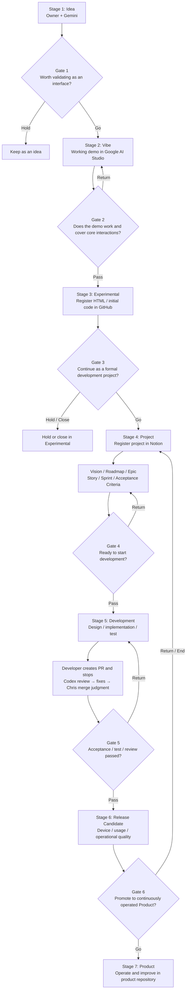

# Vibe Product Development — Operating Guide

> **Artifact status:** GitHub original for durable operating-model content. Notion remains the operational system of record for live Product/Epic/Story/Task/Sprint state, timestamps, results and Decisions.
>
> Migrated from the Notion Operating Guide on 2026-08-16 (JST).

## 1. Basic principles

- Notion is the system of record for planning, decisions, progress, daily reports, Sprint Reviews and Human Requests.
- GitHub is the system of record for code, specifications, pull requests, change history and durable ADP artifacts.
- Slack is not used for ADP operations.
- Work is managed as **Epic → Story → Task**.
- Immediately before starting a Task, record `Status = In Progress` and `Started At` in JST.
- At completion, record `Result`, `Completed At` in JST and `Status = Done`.
- Where the `task-approach-review` Skill (`cloud42-labo/skills`) is available, run it as the executable procedure behind the Approach Review referenced throughout this guide, instead of re-deriving the review steps inline (ADP-054).
- Before implementation that depends on an external SDK, library or service, verify the latest primary documentation.
- Do not create a Human Request for information or actions an AI agent can directly verify through Notion, GitHub or another connected source. Before asking a person for anything, run the Human Gate Pre-check in section 11.
- Do not fill unknowns by assumption. Record the exact blocker and next action.

## 2. AI roles

- **Claude** — primary development line; requirements understanding, design, implementation, fixes and role-separated workflows.
- **Claude Opus** — lead/manager for complex design decisions and final integration; delegates to Sonnet/Haiku where appropriate.
- **Claude Sonnet** — ordinary implementation, technical design and UI/UX design.
- **Claude Haiku** — research, mechanical verification and light work.
- **ChatGPT / Chris** — PM aide, Notion organization, cross-product review, failover, PR supervision and merge judgment.
- **Codex** — independent GitHub pull-request reviewer.
- **Gemini** — the Owner's planning/research second opinion; normally connected only to the Owner.

## 3. Development lifecycle

A **Stage** is a working state. A **Gate** is a decision condition for moving to the next Stage.

## 4. Stage and Gate definitions

1. **Stage 1: Idea** — clarify the problem, target user and value hypothesis with Gemini.  
   **Gate 1: Vibe decision** — is it worth creating an interface/experience to validate?
2. **Stage 2: Vibe** — use Google AI Studio to explore UI and interaction flow and create a working demo.  
   **Gate 2: Experimental decision** — does the demo work, cover core interactions and deserve preservation as initial code?
3. **Stage 3: Experimental** — manage prototype code in the Experimental GitHub area and perform additional validation.  
   **Gate 3: Project decision** — is it worth continuing as a formal development project? Deeper market/revenue validation normally follows creation of something users can touch.
4. **Stage 4: Project** — establish Vision, Roadmap, Epic, Story, Sprint and Acceptance Criteria.  
   **Gate 4: Development decision** — are the conditions needed to begin development complete?
5. **Stage 5: Development** — design, implement, test and perform quality checks; Codex independently reviews PRs where applicable.  
   **Gate 5: Release Candidate decision** — have acceptance criteria, tests and reviews passed without unresolved critical issues?
6. **Stage 6: Release Candidate** — validate real-device behavior, user experience, operations, security and continuity.  
   **Gate 6: Product decision** — does the product have sufficient value and quality for ongoing operation and improvement?
7. **Stage 7: Product** — provide, operate, measure and continuously improve the product in its formal repository using weekly Sprints.

## 5. Systems of record

| Information | System of Record | Notion handling |
|---|---|---|
| Product / Epic / Story / Task / Sprint | Notion | Holds formal operational state |
| Decisions / policy choices | Notion Decisions | Records conclusion and rationale |
| Product code | Product GitHub repository | Link from Notion; do not duplicate |
| Product specifications | Product GitHub repository | Notion holds reference and decision context |
| PR / review history | GitHub | Notion holds conclusion / next action only |
| Daily report / Sprint Review / Retrospective | Notion | Formal operational record |
| ADP durable operating artifacts | `cloud42-labo/ai-development-platform` | Notion holds reference and operating state |
| Organizational memory / accumulated learning | `cloud42-labo/brain` | Promote to artifact only when intentionally synthesized |

For the ADP knowledge model, see [`../governance/source-of-truth.md`](../governance/source-of-truth.md).

## 6. AI operating rules

### Common rules

- Before work, confirm Product, current Sprint, target Epic, Story, acceptance criteria and related GitHub links.
- Do not expand scope by assumption. Record unresolved matters in Decisions or Blocker.
- Do not duplicate source code or authoritative artifact text into Notion unless an operational view is intentionally maintained there.
- At the end of each execution phase, record current phase, completed work, PR/commit reference, unresolved items, stopping reason and next action in Notion.
- The Notion ticket is the execution instruction. External prompts should remain short and should not become a second detailed instruction source.

### PR / review / merge

- The implementation agent normally stops after completing required implementation/fixes and creating the PR.
- Codex independently reviews the PR diff, acceptance criteria and test evidence when required.
- Review findings live in GitHub; Notion records only the conclusion and next action.
- Do not merge with unresolved P0/P1 issues, failed CI, or required device verification incomplete.
- The merge role is normally separated from implementation and handled by ChatGPT / Chris for final verification.
- If an exception allows Claude to merge, all of the following must be true: the Owner has explicitly changed the merge responsibility; Codex review is complete where required; critical findings are resolved; CI is green; mergeability is clean; required real-device validation is complete or captured as an explicit post-merge task.

## 7. Backlog Refinement

Run Backlog Refinement for every Product after Sprint Review. Verify:

- Epic purpose, dependencies and execution order;
- correct Story/Task placement;
- duplicates, stale items and unnecessary work;
- Priority and Blocker;
- candidates for the next Sprint.

Epics should normally converge in dependency/number order. A later Epic may move ahead only when needed to satisfy a dependency of the preceding work.

## 8. Weekly Sprint operation

The weekly close occurs on Monday, in this order:

1. **Sprint Review** — review outcomes, incomplete work and blockers.
2. **Retrospective** — record Keep / Problem / Try and feed improvements into the next Sprint.
3. **Backlog Refinement** — revisit Epic/Story/Task placement and priority in two passes: Product Vision → Epic → Story → Task structural review, then How review for each Task that passes it. Do not approve a Task's How while its own Story or Epic is still unreviewed or Revise.
4. **Sprint Close** — confirm every unfinished Sprint item's disposition rather than letting it carry over implicitly.
5. **Sprint Goal review** — re-evaluate the Sprint Goal in light of Review, Retrospective and Refinement, and revise it if the underlying structure changed.
6. **Sprint Planning** — define the next Sprint's scope from the (possibly revised) Goal and include only Ready work.

`cloud42-labo/skills` provides this loop as executable Skills, chained in the order above by the `weekly-sprint` Composite: `sprint-review`, `sprint-retrospective`, `backlog-refinement` (composing `hierarchical-refinement` for the structural pass and `task-approach-review` for the How pass), `sprint-close`, `sprint-goal-review` and `sprint-planning`. A Routine or Scheduler trigger for the weekly close should hold only the target Sprint/Product and the firing time, and invoke `weekly-sprint` rather than duplicate this procedure inline. Likewise, Task-start Approach Review (section 1) should invoke `task-approach-review` where available, and Human Request creation (section 11) should invoke the `human-gate-preflight` Skill, where available, as the executable procedure behind the Human Gate Pre-check in that section. Updating a live Routine/Scheduled-Task prompt's text to this reference form is Owner UI work; current progress on any one of these invocations is Notion Task state, not durable policy, so it is tracked in Notion (ADP-054) rather than here.

## 9. Definition of Ready

- Product and Epic relations exist.
- Purpose / user story is written.
- Acceptance Criteria are verifiable.
- Dependencies and target GitHub repository are clear.
- Assigned AI and the role within the primary development line, or ChatGPT failover condition, are defined.
- Required current primary-reference checks are known before execution.

## 10. Definition of Done

- Acceptance Criteria are satisfied.
- Required tests pass.
- Required independent review and final judgment are complete.
- If Codex review is used, critical findings are resolved.
- No unresolved P0/P1 remains; CI passes; required real-device verification is complete.
- `Result`, `Completed At` and `Status` are updated in Notion.
- Related Story, Decision, Sprint or other operational state is updated as needed.

## 11. Human Request rules and the Human Gate Pre-check

### 11.1 When a Human Request is legitimate

Create Human Requests in Stories & Tasks with `Type = Human Request` only for actions that genuinely require a person, such as:

- real-device operations the AI cannot perform;
- permission, billing or account actions that require the Owner;
- business decisions that require human authority;
- physical-world validation unavailable to connected tools.

Rules:

- If an AI can directly inspect Notion, GitHub or another connected source, do not create a Human Request merely to have a person read it.
- Write Human Requests as concrete executable procedures with explicit completion evidence.
- When a person starts, record `Status = In Progress` and `Started At` (JST).
- On completion, record `Result`, `Completed At` (JST), and `Status = Done`.
- Always present Notion ticket names as clickable links when asking the Owner to act.

### 11.2 Human Gate Pre-check

Run the Human Gate Pre-check immediately before either of the following, and complete it **before** the action rather than correcting afterwards:

- creating a Stories & Tasks record with `Type = Human Request`;
- setting any task to `Blocked` where the stated Blocker is Human action or Human confirmation.

This is a gate, not a reminder. If the pre-check has not been run, the Human Request must not be created and the Blocked transition must not be made. The executable form of the gate is in [`../governance/ai-execution-constraints.md`](../governance/ai-execution-constraints.md).

The reason the gate exists is that the expensive failure is rarely a missing Human. It is a Human gate that was correct when it was written and was never re-evaluated once the evidence arrived. Work then stops on a note the AI wrote to itself, while the person it names is waiting for nothing. Because a Human gate blocks an entire dependency chain upward, a single stale gate can hold a Story or Epic still for days.

### 11.3 Sources to search before declaring a Human gate

Search every source below that could plausibly hold the evidence, and record which were searched:

| Source | What to look for |
|---|---|
| Notion Stories & Tasks | An existing Task/Subtask covering the same check; its `Result`, `Completed At` and Blocker text; sibling tasks that already consumed the same evidence |
| Notion Decisions, daily reports, Sprint Reviews, feedback pages | Human action already taken — sessions run, surveys received, approvals given, purchases made |
| GitHub | PR state and merge commit, review threads and their resolution, commits, released artifacts |
| CI and tests | Workflow runs on the relevant branch or merge commit, individual job and step conclusions, job logs |
| Existing user feedback | Survey responses, training or lab session feedback, reports already collected and analysed |
| Past Human behaviour | What the Owner already did for equivalent work, and whether the requested action has effectively already happened under a different name |

One tool failing is not evidence that a Human is required. When a connector cannot retrieve the record — a GitHub integration that only exposes pull-request-triggered runs, a search that returns nothing — try another tool, another agent's connector, or the underlying API before concluding the check is Human-only. Record which paths were tried, so the next agent does not repeat a dead end or inherit its conclusion.

### 11.4 Classify each Acceptance Criterion

Classify **each Acceptance Criterion separately**, never the task as a whole. A task is Human-only only for the specific criteria that are.

- **AI-verifiable** — the AI can establish the answer now through a connected source. Whether a CI job or step passed, whether a PR merged, whether a file contains a required disclosure, whether a test covers a case, whether a headless run renders the required elements.
- **Human evidence already exists** — the criterion requires a Human act, and that act has already happened and is recorded: a survey already answered by real users, a training session already run, an approval already given, a payment already made, an account already created. The evidence must be a specific linkable record with a date, not an inference that the Owner probably did it.
- **Human-only** — the criterion requires a person and no adequate record exists yet. This is the correct classification for real-device operation and physical-world observation; granting permissions or credentials; account creation, identity verification, contracts, purchases and payment; approvals carrying legal or financial responsibility; business decisions inside the Owner's authority; irreversible changes; and anything needing access only the Owner holds.

Borderline guidance:

- "Someone should look at this and report the result" is AI-verifiable whenever the thing to be looked at is reachable from a connected source. Reading a dashboard is not Human work.
- Subjective judgement by real users — is this understandable, would you pay for this — is Human-only, and an AI's own assessment never substitutes for it.
- Human evidence is scoped to what was actually observed. A survey that answered two of four questions satisfies two criteria, not four.

### 11.5 Act on the classification

- **All criteria AI-verifiable or already satisfied by Human evidence** — do not create a Human Request and do not transition to `Blocked`. Verify the criteria directly, record the evidence and its links in `Result`, and complete the task through the normal completion post-flight.
- **Some criteria Human-only** — first complete and record every AI-verifiable criterion. Then create a Human Request covering only the Human-only remainder, written as a concrete action with explicit completion evidence. Never hand a whole task to a person because part of it needs one.
- A `Blocked` transition **for a Human reason** is permitted only while a genuinely Human-only criterion is outstanding, and the Blocker text must name that criterion and the request carrying it rather than the task as a whole. This section governs Human-reason blocks only; a task blocked on an unavailable AI dependency, an infrastructure outage, or another non-Human cause follows the ordinary `Blocked` rules in 11.1 and is untouched by this gate.
- Record the classification and the sources searched in `Result` or `Approach Decision`, so the next agent can re-evaluate the gate instead of repeating the search.

### 11.6 Standing re-evaluation of existing Human gates

Human gates decay, so they are re-checked rather than trusted. During daily autonomous execution, re-run the pre-check over every open `Type = Human Request` and every task `Blocked` for a Human reason:

1. Re-evaluate each Acceptance Criterion against the current state of Notion, GitHub, CI and collected feedback.
2. Where evidence has arrived since the gate was written, correct the record: verify the criteria the evidence satisfies, write the correcting reason and the evidence links into `Result`, and move the task out of the gate.
3. Where a parent Story or Task is Blocked on a child that has since completed, clear the parent's stale Blocker too. Stale blockers propagate upward and stall whole Epics. A Blocker that names a specific task or request is verified with a single lookup, which is what makes this sweep affordable daily — so write Blockers that way.
4. A satisfied Human gate does not by itself complete the task. Where AI work remains once the Human portion is evidenced, return the task to `Ready` with the residual work named. `Blocked` and `Done` are both wrong for "the person finished; the machine has not started".
5. Correct only what located evidence supports. Where the evidence cannot be found, leave the state unchanged and record why the gate remains open.
6. Where a gate stalled work that was already satisfied, execute [`../governance/postmortem-improvement-loop.md`](../governance/postmortem-improvement-loop.md).

No new service, scheduled job or classification engine is introduced for this. The pre-check is run by the agent already doing the work, using sources it is already connected to.

Worked examples of the classification, including a false gate, a genuine gate and a partial gate, are in [`human-gate-pre-check-examples.md`](human-gate-pre-check-examples.md).

### 11.7 Human Queue WIP limit

Even after the Human Gate Pre-check removes false gates, genuinely Human-only work can still arrive faster than the Owner can process it. The Human Queue itself needs a work-in-progress limit, the same way any other queue does.

- **Actionable Human Queue** is defined as every Task with `Assigned Agent = Human` and `Status` in `Ready`, `In Progress`, or `Review`. The Notion view `Human Queue｜Actionable` in Stories & Tasks shows this live; do not hand-copy its count elsewhere (section 13).
- **Initial WIP limit is 5**, set as a PoC baseline on 2026-08-25. `P0` items are an exception and do not count against the limit — a P0 always enters the Actionable Queue.
- **Priority order inside the queue is P0 → P1 → P2.** When the Owner works through the queue, or when deciding what stays Actionable under the limit, always clear higher priority first.
- **When the Actionable Queue is at or over the WIP limit**, do not create a new non-urgent Human Request to grow it further. Instead, before adding anything new:
  1. Re-run the Human Gate Pre-check (section 11.2–11.5) over the existing queue — a Task may no longer need a Human once fresh evidence exists.
  2. Look for AI-substitutable Human Tasks — work that reads as Human-only mainly because AI-doable preparation (research, drafting, asset generation, evidence collection) was bundled in with the genuinely Human-only remainder. Split those: complete the AI-doable part now and shrink the Human Request to the remainder only.
  3. Consolidate or close duplicate/unneeded Human Tasks.
  4. Only after 1–3 are exhausted, move a non-urgent new Human item to `Backlog` with a Blocker naming the WIP limit, rather than adding it to the Actionable Queue.
- **This changes AI task selection too.** When the Actionable Human Queue is over its limit, an autonomous AI run (Claude daily execution, Chris hourly execution) should prefer work that reduces the queue — the substitution/consolidation/pre-processing above — over starting new work that would create additional Human gates.
- Record queue size before/after and the reclassification results in the initiating Task's `Result` (see ADP-043-I for the initial application). Track the Actionable Queue count and its trend as a Human-bottleneck indicator in Sprint Review.

### 11.8 Current-gate relevance (state transition boundary)

Sections 11.2–11.6 classify each Acceptance Criterion. That classification alone is not sufficient to decide whether the **transition currently being evaluated** should wait — a criterion correctly classified `Human-only` can still belong to a *later, independent* transition in the same End-to-End flow, and blocking the current one on it is a false gate of a different shape than the ones 11.2–11.6 already catch.

This section exists because of a real incident (Postmortem PM-8, 2026-09-01): `serendipity-spot #27` and `experimental #85` were both classified `Human待ち` and their PR merge treated as stopped, even though `#27`'s real-device UI check was never a merge precondition and `#85`'s real-environment deployment/secrets Acceptance is a *post-merge* step. The wrong implicit logic was `Human-only work exists somewhere → current transition must wait`. The correct logic is `Human-only work exists → identify the current transition → verify the Human judgment/evidence is a mandatory prerequisite of this exact transition → block only if yes`.

**This is a narrowing filter on top of 11.2–11.6, not a new Stop Gate.** It never blocks a transition that 11.2–11.6 would otherwise clear; it only prevents a `Human-only` criterion belonging to a *different* transition from stopping the *current* one. An existing, genuinely mandatory gate for the current transition is untouched.

Before setting a task/PR to a Human-reason `Blocked` state, or reporting a PR as "waiting on Human" in a backlog sweep, for every criterion classified `Human-only` in 11.4:

1. **Name the current transition precisely** — e.g. "PR review → merge", not "task completion" or "ship the feature" in general. A flow like design → implement → PR review → merge → deploy → real-device Acceptance → publish has several distinct transitions; the check applies separately to whichever one is actually being evaluated right now.
2. **Ask whether the Human-only criterion is a mandatory prerequisite of that exact transition**, or whether it belongs to a transition that comes *after* it (deployment, publication, real-device/environment Acceptance, or any other downstream step). A criterion that only needs to be true before a *later* transition is not a precondition of the current one.
3. **If an accountable reviewer has already explicitly tied this criterion to the current transition** (e.g. an existing "will not merge until X" review or comment), treat it as a mandatory prerequisite of the current transition regardless of step 2's general reasoning, unless that same or an equally accountable authority has since explicitly revised it — a dated comment/review naming what changed, not an AI's own inference that the earlier decision "shouldn't" apply. This mirrors the AI-to-AI stop gate pre-flight's own principle (section 12's authority precedence; `governance/ai-execution-constraints.md`'s "Preserve existing authorised flow"): this check narrows an AI-invented over-block, it does not authorize overriding a still-current human decision on the AI's own reasoning. See Case 2 in the regression cases below for a worked example of a genuine gate later revised by its own author.
4. **Block the current transition only when step 2 says yes, or step 3's gate is still standing.** When the Human-only criterion belongs to a downstream transition and no accountable reviewer has tied it to the current one, the current transition proceeds on its own actual gates (e.g. required review, CI, mergeability) — do not report the current transition as Human-blocked. Route the downstream Human-only work as its own Human Request, scoped to the transition it actually gates (e.g. "confirm real-device rendering after merge", not "confirm before merge").
5. **Record the transition, the criterion, the step-2/3 answer, and (when demoting an existing gate) the specific revision evidence** in the same place 11.6 records the classification (`Result` or `Approach Decision`), so a later re-check does not need to re-derive it.

This check runs alongside the standing re-evaluation in 11.6: a PR backlog sweep that finds a Human-only criterion must apply this section before reporting the PR as Human-blocked, not only when a new gate is first created. Two worked regression cases (`#27`, `#85`) and their pass criteria are in [`../governance/state-transition-pre-check-regression-cases.md`](../governance/state-transition-pre-check-regression-cases.md); the executable form of this check is in [`../governance/ai-execution-constraints.md`](../governance/ai-execution-constraints.md).

## 12. Chris → Claude handoff

Treat the transition from Epic design to executable implementation design as a formal AI-to-AI baton pass.

### Chris / ChatGPT responsibility — Why / What

- Confirm Product purpose and current state.
- Define Epic Goal / Objective / Success Metric.
- Organize dependencies, priority and execution order across Epics.
- Create the initial Story set needed to satisfy the Epic.
- Write Story Acceptance Criteria sufficiently clearly for Claude to review completeness.
- Avoid prematurely fixing implementation details or decomposing into mechanical Subtasks unless Chris is the execution owner.

### Claude / Opus responsibility — How / Executable

- Read the Epic, Success Metric and Stories from Notion.
- Review whether the Story set is sufficient to satisfy the Epic Success Metric.
- Add, revise or remove Stories when needed within the existing Epic purpose.
- Decompose each Story into executable Subtasks.
- Each Subtask should contain target, procedure, checks, Acceptance Criteria and required references.
- Select Opus / Sonnet / Haiku according to the nature of the work.
- If the work requires changing the Epic Goal, Success Metric or business priority, return to Chris / Owner rather than changing it autonomously.

### Handoff completion conditions

Chris → Claude is complete when Notion shows at least:

1. Product relation;
2. Epic Objective / Success Metric / Priority;
3. Story candidates related to the Epic;
4. Story Acceptance Criteria sufficient for completeness review;
5. known dependencies, constraints and authoritative-source links.

Claude → execution agent is complete when each Subtask can be read as an executable instruction by itself.

## 13. Portfolio top-page principle

The Vibe Product Development top page is a dashboard, not the policy manual.

- Do not maintain hand-copied progress numbers or fixed priority statements when live database views can show current state.
- Treat live database state as authoritative for current status.
- Keep the top page optimized for current position, focus, key links and important visualizations.
- Keep detailed rules, definitions and exception conditions in this Operating Guide and related governed artifacts.

## 14. Portfolio Health automation

Portfolio Health is an **objective derived signal**, not a manually assigned opinion. Manual Health fields are retained only as legacy history and must not be used for prioritization.

`Health Auto` is derived from Epic and Task risk signals using `Priority`, `Status`, and operational deadlines (`Target` / `Due Date`). Manual `Health` and `Schedule` values are not inputs to the calculation.

Risk rules:

- **Red** — any P0 Task is `Blocked`, or any P0 Epic is `Paused`.
- **Yellow** — any P1 Task is `Blocked`; any open P0 Task is past `Due Date`; any P1 Epic is `Paused`; or any open P0/P1 Epic is past `Target`.
- **Green** — none of the Red or Yellow conditions apply.

Portfolio views must display `Health Auto`. Legacy manually entered Health is named `Health Manual (Legacy)` and is non-authoritative.

The purpose of Health is to expose priority and delivery risk, not to create an independent priority signal. If Health appears wrong, fix the underlying Priority, Status, Target, Due Date, or relationship data rather than manually changing Health.
